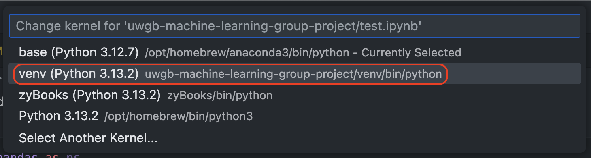

# UWGB COMP SCI 465 - Machine Learning Group Project

Repository containing the two group project assignments required for completion of the UWGB COMP SCI 465 Machine Learning course.

## Prerequisites

The only dependency that should be required to open and run the project is the Python runtime. Having a Python editor that supports Jupyter cells is idea, since this project leverages Jupyter for its machine learning code.

## Project Setup

After installing Python on your target system/platform, create and activate a Python virtual envirornment (venv) in the root directory of the project by executing the following:

```bash
python3 -m venv venv
```

Then, to activate the virtual environment on POSIX-compliant systems running Bash (i.e. MacOS or Linux), the following command can be used:

```bash
source venv/bin/activate
```

> [!NOTE]
> If running a Windows system, the script to activate the virtual environment will be slightly different. To accomplish this using PowerShell, here is the command that needs to be run:
> ```pwsh
> Set-ExecutionPolicy -ExecutionPolicy Bypass -Scope Process
> .\venv\Scripts\Activate.ps1
> ```

After the virtual environment is active, the dependencies can be installed using the `requirements.txt` file like so:

```bash
python3 -m pip install -r requirements.txt
```

Afterwards, when running the Jupyter notebooks in a code editor, this new virtual environment should show up when selecting the Python environment in which the cells should be run. Shown below is an example of selecting the "Kernel" (as it is called in Visual Studio Code):


